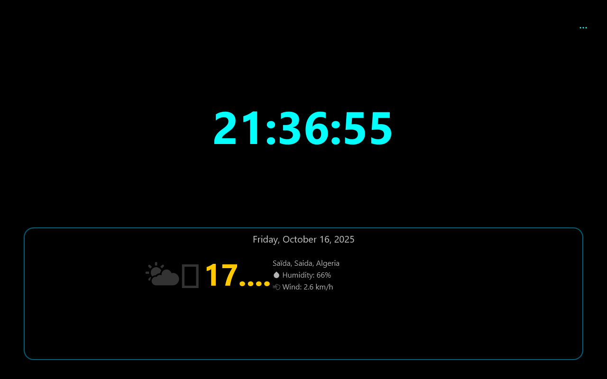
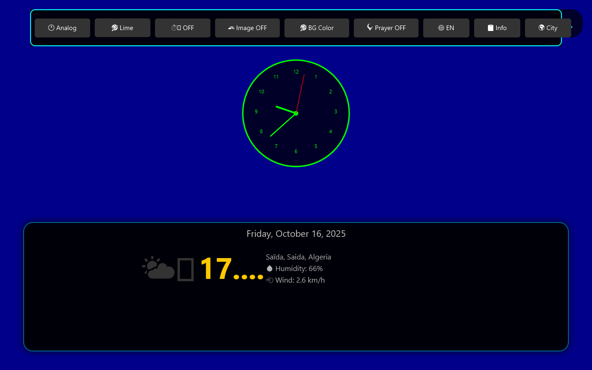
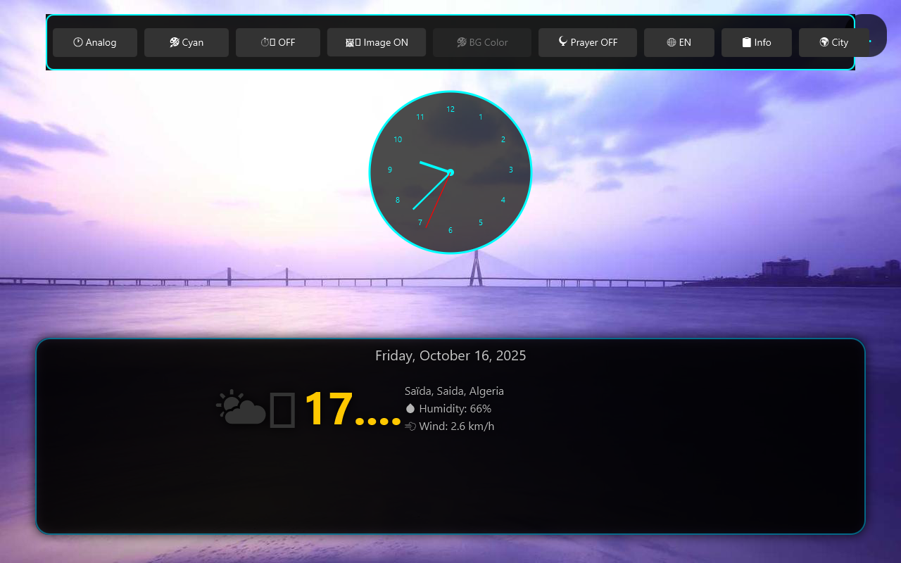
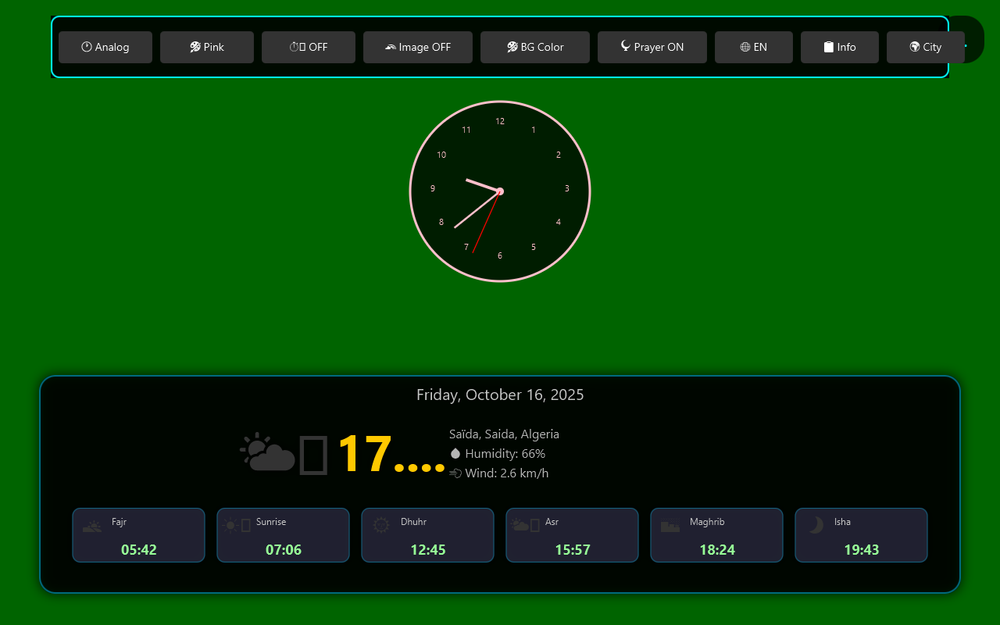

# Clock-Desk 🕐

A modern, feature-rich fullscreen clock application for desktop with real-time weather data, Islamic prayer times, and multilingual support. Built with B4J (Basic4Java) and JavaFX.

## 📸 Screenshots

### Digital Clock Mode

### Analog Clock Mode

### Weather & Prayer Times

### Settings Panel

### Multilingual Support (Arabic)

## ✨ Features

### 🎨 Display Modes
- **Digital Clock**: Large, customizable digital time display (up to 128px font)
- **Analog Clock**: Classic analog clock with smooth animations
- **Responsive Design**: Automatically adapts to any screen resolution
- **Fullscreen Mode**: Distraction-free clock display

### 🌤️ Weather Integration
- Real-time weather data from Open-Meteo API
- Temperature, humidity, and wind speed
- Dynamic weather emoji icons
- Global city search with geocoding
- Automatic location saving

### 🕌 Prayer Times
- Accurate Islamic prayer time calculations
- Muslim World League calculation method
- Beautiful card-based display layout
- Toggle on/off functionality
- Support for worldwide locations

### 🌍 Multilingual Support
- **Languages**: English, French, Arabic
- RTL (Right-to-Left) support for Arabic
- Translated UI elements
- Easy language switching

### 🎨 Customization
- **10 Color Themes**: Cyan, White, Yellow, Orange, Magenta, Lime, Pink, Red, Green, Random
- **Background Images**: Rotating backgrounds with customizable intervals (5s - 1h)
- **Solid Color Backgrounds**: Alternative to images
- **Transparent Info Panel**: Modern overlay design

## 🚀 Getting Started

### Prerequisites

- **B4J IDE** version 9.0 or higher - [Download](https://www.b4x.com/b4j.html)
- **Java JDK** 11 or higher
- Internet connection (for weather and geocoding)

### Required B4J Libraries

- B4XPages
- jCore
- jFX
- jHttpUtils2
- jJSON
- XUI Views

### Installation

1. **Clone the repository**:
git clone https://github.com/aziznetstudio-shamildev/Clock-Desk.git
cd Clock-Desk

text

2. **Open in B4J**:
- Launch B4J IDE
- File → Open → Select the `.b4j` file

3. **Compile and Run**:
- Press F5 or click "Run"

## 🎮 Usage

### Keyboard Shortcuts

| Key | Action |
|-----|--------|
| `ESC` | Exit application |
| `F11` | Toggle fullscreen |

### Settings Panel

Click ⚙️ (top-right) to access:

- 🔢 **Clock Mode**: Switch between digital/analog
- 🎨 **Theme**: Change clock colors
- ⏱️ **Image Timer**: Set background rotation interval
- 🖼️ **Background**: Toggle background images
- 🎨 **BG Color**: Change solid background color
- 🕌 **Prayer**: Toggle prayer times display
- 🌐 **Language**: Switch language (EN/FR/AR)
- 📋 **Info**: Toggle info panel visibility
- 🌍 **City**: Search and change location

## 🌐 APIs Used

- [Open-Meteo Weather API](https://open-meteo.com/) - Free weather data
- [Open-Meteo Geocoding API](https://open-meteo.com/en/docs/geocoding-api) - City search
- [Lorem Picsum](https://picsum.photos/) - Background images

## 📐 Prayer Time Calculation

- **Method**: Muslim World League
- **Fajr Angle**: 18°
- **Isha Angle**: 17°
- **Asr Method**: Shafi/Maliki/Hanbali
- **Accuracy**: ±1 minute

Based on astronomical algorithms from [PrayTimes.org](http://praytimes.org/)

## 🤝 Contributing

Contributions are welcome! Please:

1. Fork the repository
2. Create a feature branch (`git checkout -b feature/NewFeature`)
3. Commit your changes (`git commit -m 'Add NewFeature'`)
4. Push to the branch (`git push origin feature/NewFeature`)
5. Open a Pull Request

## 📋 Roadmap

- [ ] Add more Islamic calculation methods
- [ ] Hijri calendar display
- [ ] Custom font selection
- [ ] Alarm and timer functionality
- [ ] Weather forecast (3-7 days)
- [ ] Customizable prayer alerts

## 📄 License

This project is licensed under the MIT License - see the [LICENSE](LICENSE) file for details.

## 👨‍💻 Author

**Aziz Net Studio - Shamil Dev**
- Location: Saïda, Algeria 🇩🇿
- GitHub: [@aziznetstudio-shamildev](https://github.com/aziznetstudio-shamildev)

## 🙏 Acknowledgments

- Built with [B4J](https://www.b4x.com/b4j.html) by Anywhere Software
- Weather API by [Open-Meteo](https://open-meteo.com/)
- Prayer algorithms from [PrayTimes.org](http://praytimes.org/)
- B4X developer community

## ⭐ Support

If you find this project useful:
- ⭐ Star the repository
- 🐛 Report bugs via [Issues](https://github.com/aziznetstudio-shamildev/Clock-Desk/issues)
- 💡 Suggest features
- 🔀 Fork and contribute

---

**Made with ❤️ in Algeria | Built for the Muslim community worldwide 🌍**